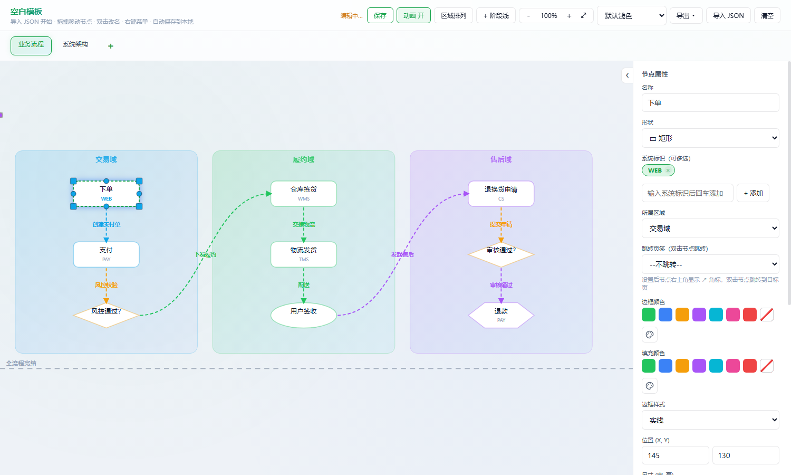
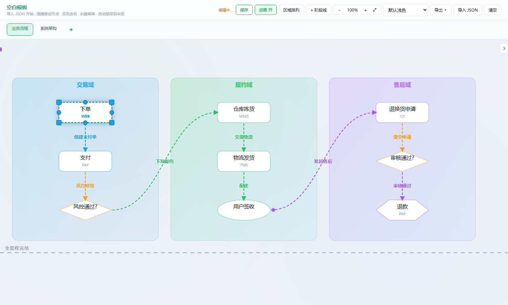
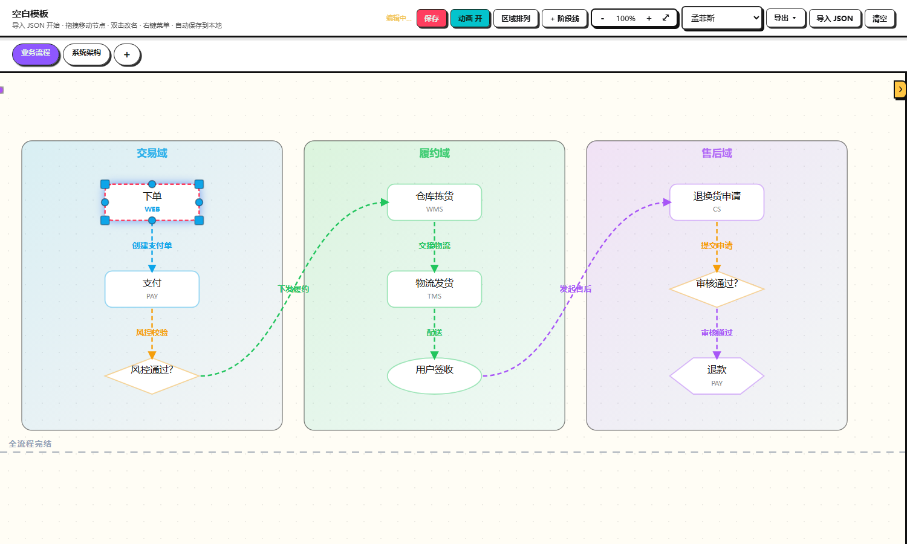
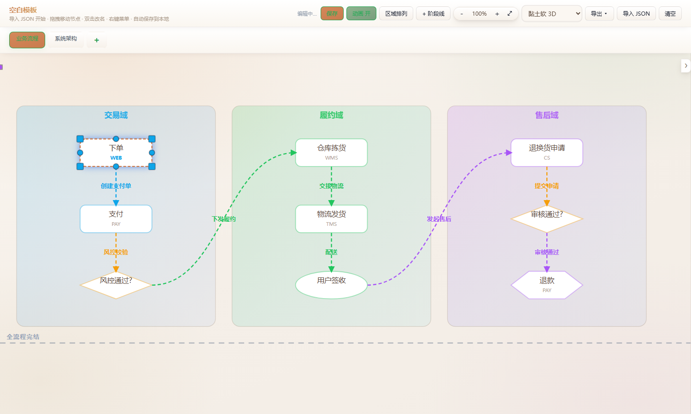
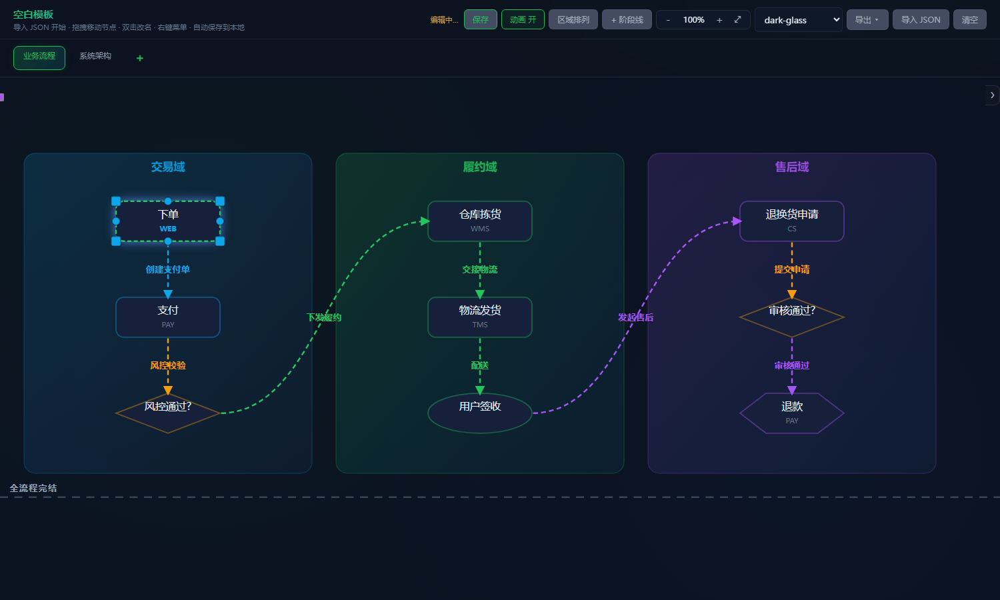
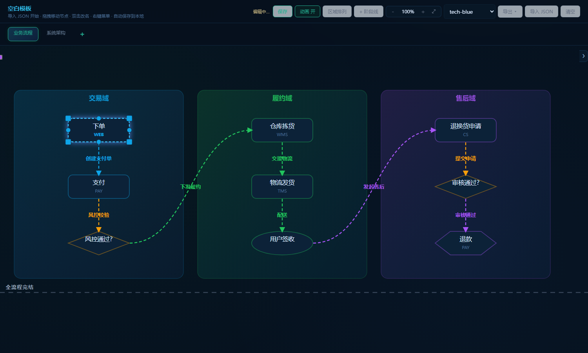

# 空白模板 · Blank Flow Diagram Template

**一个零依赖、单文件的 SVG 可编辑图编辑器。** 让 AI 生成一份 JSON，导入进来就是一张可继续拖拽编辑的流程图 / 架构图 / 数据流图。




---

## 这是什么

画图的工具很多，但大多数要么重（要装软件、要注册），要么封闭（图形不落成可读数据，没法让 AI 批量生成）。

这个模板反过来：**图 = JSON**。你让 AI 输出一段符合约定的 JSON，导入模板就能得到完整可交互的图，之后还能在浏览器里继续拖拽、改色、改名，再导回去。

整个项目就一个 HTML 文件 —— 没有构建步骤、没有 npm install、没有后端、没有网络请求。双击打开就能用，发给别人也能用。

**适合**：业务流程、系统架构、数据流、状态机、阶段规划、多页签方案图集。
**不适合**：需要精确坐标的工程制图、大量节点（>60）的超大图、协作编辑。

---

## 效果

三列纵向流程，区域分组、四种节点形状、连线带方向箭头与文字说明、底部阶段线；右侧是选中节点后的属性面板。


收起右侧面板就是一张干净的图：



---

## 特性

- **单文件零依赖** —— 一个 `.html`，离线可用，无外部请求；拷走即用
- **AI 友好** —— 数据结构是纯 JSON，可直接让大模型生成（见下方「两种使用方式」）
- **多页签** —— 每页独立图数据，可自由增删、拖拽排序、双击改名
- **区域分组** —— 半透明彩色容器，充当泳道 / 域 / 子系统
- **四种节点形状** —— 矩形、圆形、菱形（审批判断）、六边形（数据 / 存储）
- **三种连线样式** —— 曲线 / 直线 / 正交折线，可指定四向锚点、调曲率、加文字备注
- **边框与填充分离** —— 边框色、填充色独立设置；边框支持实线 / 虚线 / 无
- **阶段线** —— 横贯画布的虚线，用于划分阶段、里程碑
- **颜色体系** —— 17 个命名色 + 无颜色 + 任意十六进制；带最近使用颜色
- **6 套主题** —— 浅色 / 孟菲斯 / 黏土软 3D / dark-glass / tech-blue / emerald-night，实时切换并记忆
- **编辑体验** —— 拖拽移动、双击改名、右键菜单、居中弹窗编辑、撤销、框选与多选
- **导出** —— JSON（含全部页签与阶段线）、PNG、GIF 动图
- **本地自动保存** —— 编辑后自动存浏览器，刷新不丢；也支持手动保存
- **数据兼容** —— 导入自动归一化并迁移旧版数据，老文件照常打开

---

## 快速开始

1. 下载 `空白模板.html`
2. 双击用浏览器打开（Chrome / Edge / Safari 均可）
3. 开始画，或者导入一份 JSON

### 方式一 · 提示词生成 JSON（轻量、可控）

适合自己清楚要什么图、想逐项把控细节的情况。

1. 打开 [`空白模板_JSON结构与Prompt模板.md`](空白模板_JSON结构与Prompt模板.md)
2. 把「**通用块 A**」+ 任选一个「**任务块 B**」拼成一段提示词，发给任意 AI
3. 把 AI 输出的 JSON 存成 `xxx.json`（**必须是纯 JSON，不要带 ``` 代码块**）
4. 回到浏览器 → 右上角「**导入 JSON**」→ 选中该文件

> 提示词模板覆盖 7 种图型：业务流程、系统架构、数据流、状态机、审批决策、多页签图集、阶段划分。

### 方式二 · 使用 skill（省事、全流程）

适合给了文档 / 源码 / Mermaid，或者只说一句「帮我做成图」的情况。

配套 skill `flow-diagram` 会自动走完「抽取结构 → 生成 JSON → 导入空白模板」整套流程。

**触发说法**：

```
把这个文档做成架构图
画一张订单履约的流程图
把这段 mermaid 转成可编辑的图
把这个项目的模块依赖画出来
```

两种方式的**产物完全一致**（一份 JSON + 同一个模板），区别只在于 JSON 由谁写。

---

## 操作说明

| 操作 | 效果 |
|---|---|
| 拖动节点 / 区域 | 移动位置 |
| 双击节点 | 直接改名（居中弹窗，也支持回车确认 / ESC 取消） |
| 双击区域标题 / 页签 / 页面标题 | 改名 / 改备注 |
| 右键节点 | 菜单：跳转页签、从此连线、切形状、复制、删除 |
| 右键区域 | 菜单：节点排列（均匀分布 / 水平居中 / 垂直居中）、添加节点、删除 |
| 右键连线 | 菜单：备注、样式、颜色、删除 |
| **右键画布空白处** | 添加区域 / 添加节点（落在点击位置） |
| 点击连线 | 改名 / 删除 |
| 按 `Delete` | 删除选中项 |
| 滚轮 | 上下滑动画布 |
| 顶部 `−` `+` | 缩放（也可 `Ctrl/⌘ + 滚轮`） |
| 顶部「区域排列」 | 当前页所有区域顶对齐 + 横向分布 |
| 顶部「+」（页签栏末尾） | 新增页签 |
| 顶部「导入 JSON / 导出」 | 数据进出（导出支持 JSON / PNG / GIF） |

---

## 主题

顶部下拉实时切换，选择会被记住。主题只改**界面皮肤**，不影响图里的数据配色。

| 孟菲斯 | 黏土软 3D |
|---|---|
|  |  |

| dark-glass | tech-blue |
|---|---|
|  |  |

---

## JSON 数据格式

导入时对文件**全文**做 `JSON.parse` —— 不能有注释、不能有 ``` 代码块、不能有任何说明文字。

### 骨架

```json
{
  "version": 1,
  "appTitle": "订单履约流程",
  "tabs": [
    {
      "id": "tab1", "label": "业务流程", "desc": "交易 → 履约 → 售后",
      "zones":  [ { "id":"z1", "x":30, "y":70, "w":360, "h":400, "label":"交易域",
                   "color":"sky", "fill":"", "borderStyle":"solid" } ],
      "nodes":  [ { "id":"n1", "x":145, "y":130, "w":130, "h":50, "name":"下单",
                   "sys":["WEB"], "color":"sky", "fill":"", "borderStyle":"solid",
                   "zone":"z1", "shape":"rect", "linkTab":"" } ],
      "flows":  [ { "id":"f1", "from":"n1", "to":"n2", "color":"sky",
                   "fs":"bottom", "ts":"top", "style":"curve", "curve":1,
                   "note":"创建支付单" } ],
      "hlines": [ { "id":"h1", "y":500, "label":"全流程完结" } ]
    }
  ]
}
```

### 字段速查

| 对象 | 字段 |
|---|---|
| **节点** | `id` `x` `y` `w` `h` **`name`** `sys[]` `color` `fill` `borderStyle` `zone` `shape` `linkTab` |
| **区域** | `id` `x` `y` `w` `h` **`label`** `color` `fill` `borderStyle` |
| **连线** | `id` `from` `to` `color` `fs` `ts` `style` `curve` `note` |
| **阶段线** | `id` `y` `label` |
| **页签** | `id` `label` `desc` `nodes` `flows` `zones` `hlines` |

### 取值

| 字段 | 允许值 |
|---|---|
| `color` / `fill` | `emerald` `blue` `amber` `purple` `cyan` `pink` `red` `slate` `lime` `teal` `sky` `indigo` `violet` `fuchsia` `rose` `orange` `yellow` ／ `"none"` ／ `"#RRGGBB"` |
| `borderStyle` | `solid` ／ `dashed` ／ `none` |
| `shape` | `rect` ／ `circle` ／ `rhombus`（审批判断）／ `hexagon` |
| `style`（连线） | `curve` ／ `line` ／ `poly` |
| `fs` / `ts`（锚点） | `top` ／ `bottom` ／ `left` ／ `right` ／ `null` |

### 坐标与布局

- 画布 `viewBox = 0 0 1200 560`，原点左上角，`x/y` 是元素**左上角**坐标
- 节点建议 `130×50`，区域建议 `200×150`
- 节点之间水平 / 垂直间距 ≥ 40px
- 区域要包住子节点：`zone.x + 20 ≤ node.x` 且 `node.x + node.w ≤ zone.x + zone.w - 20`
- 区域标签在左上角占约 `100×20`，子节点别压上去

> 完整契约、布局公式与自检清单见 [`空白模板_JSON结构与Prompt模板.md`](空白模板_JSON结构与Prompt模板.md)。

### 三个最容易踩的坑

1. **节点名用 `name`，区域名用 `label`** —— 混用会导致名称空白
2. **`shape` 没有 `diamond` / `hex`** —— 菱形是 `rhombus`，六边形是 `hexagon`
3. **导入是整份替换** —— 会覆盖当前所有页签，已有图请先「导出 JSON」备份

---

## 文件结构

```
.
├── 空白模板.html                    # 主程序：单文件编辑器（打开这个）
├── 空白模板_JSON结构与Prompt模板.md  # JSON 契约 + 7 种图型的提示词模板
├── README.md
├── LICENSE
└── screenshots/                     # README 配图
```

---

## 常见问题

**导入提示「格式错误」？**
AI 输出里带了 ```json 代码块、注释或解释文字。删掉，只留纯 JSON。

**导入后没反应？**
检查 `tabs` 是不是非空数组，以及 `flow.from` / `flow.to` 指向的节点 id 是否存在。id 重复也会导致渲染异常。

**数据和别人冲突？**
不会。每份模板用独立的浏览器本地存储键，互不覆盖。

**能离线用吗？**
可以，全程无网络请求。主题里也没有外部字体。

**为什么新节点不带系统标识？**
通用模板不预置业务标签，节点上的 `sys` 标识自行添加。

**节点太多画不下？**
画布固定 1200×560。拆成多个页签，每页 6–12 个节点体验最好。

---

## 协议

[MIT](LICENSE) —— 可自由使用、修改、分发，保留版权声明即可。
